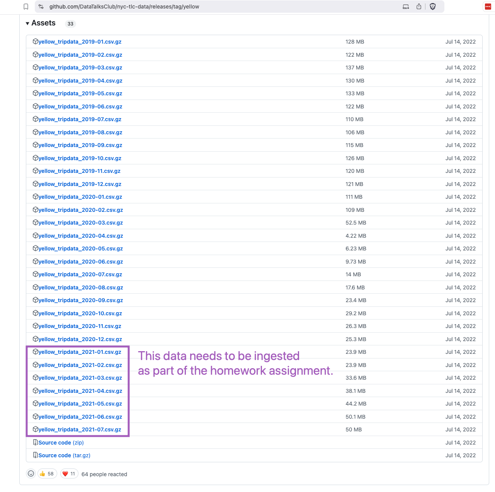
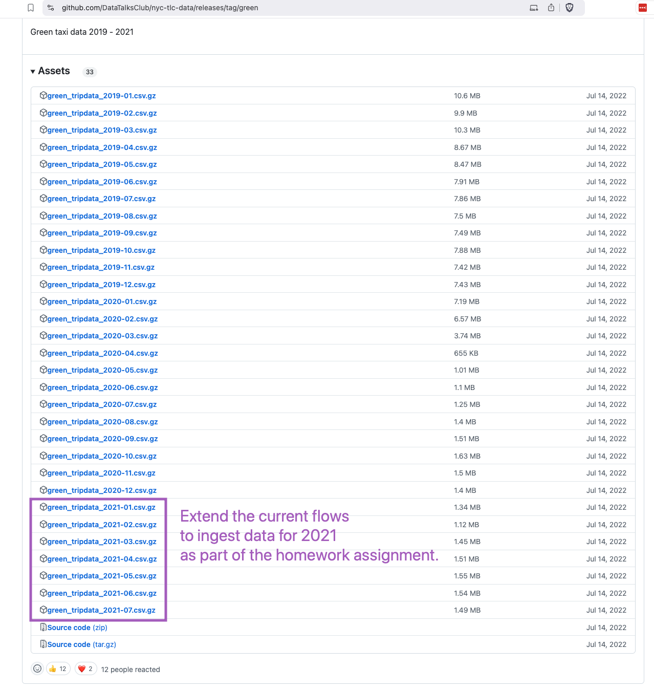

## Module 2 Homework

### Assignment

So far in the course, we processed data for the year 2019 and 2020. Your task is to extend the existing flow to include data for the year 2021.

As a hint, Kestra makes that process really easy:
1. You can leverage the backfill functionality in the [scheduled flow](../flows/07_gcp_taxi_scheduled.yaml) to backfill the data for the year 2021. Just make sure to select the time period for which data exists i.e. from `2021-01-01` to `2021-07-31`. Also, make sure to do the same for both `yellow` and `green` taxi data (select the right service in the `taxi` input).
2. Alternatively, run the flow manually for each of the seven months of 2021 for both `yellow` and `green` taxi data. Challenge for you: find out how to loop over the combination of Year-Month and `taxi`-type using `ForEach` task which triggers the flow for each combination using a `Subflow` task.

### Questions

Within the execution for `Yellow` Taxi data for the year `2020` and month `12`: what is the uncompressed file size (i.e. the output file `yellow_tripdata_2020-12.csv` of the `extract` task)?
- 128.3 MB
- 134.5 MB
- 364.7 MB
- 692.6 MB

What is the task run state of tasks bq_green_tripdata, bq_green_tmp_table and bq_merge_green when you run the flow with the `taxi` input set to value `yellow`?
- `SUCCESS`
- `FAILED`
- `SKIPPED`
- `CANCELED`

How do we deal with table schema in the Google Cloud ingestion pipeline?
- We don't define the schema at all because this is a data lake after all
- We let BigQuery autodetect the schema
- Kestra automatically infers the schema from the extracted data
- We explicitly define the schema in the tasks that create external source tables and final target tables

How does Kestra handles backfills in the scheduled flow?
- You need to define backfill properties in the flow configuration
- You have to run CLI commands to backfill the data
- You can run backfills directly from the UI from the Flow Triggers tab by selecting the time period
- Kestra doesn't support backfills

## Submitting the solutions

* Form for submitting: https://courses.datatalks.club/de-zoomcamp-2025/homework/hw2 - TBD we may prefer creating a form with Kestra Apps if possible so that we can automate the grading process
* Check the link above to see the due date
  
## Solution

Will be provided after the due date.
