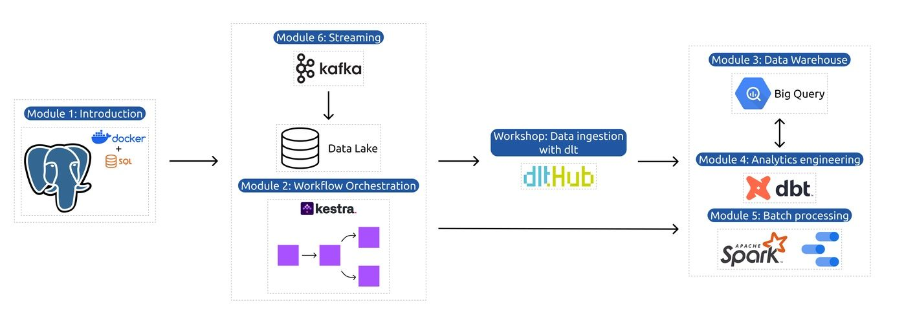

# Week 2: Workflow Orchestration

Welcome to Week 2 of the Data Engineering Zoomcamp! This week, we'll cover workflow orchestration with [Kestra](https://github.com/kestra-io/kestra).

Kestra is an open-source, event-driven orchestration platform that makes both scheduled and event-driven workflows easy. By bringing Infrastructure as Code best practices to data, process, and microservice orchestration, you can build reliable workflows [directly from the UI](https://kestra.io/docs/getting-started/quickstart) in just a few lines of YAML.

The course will cover the basics of workflow orchestration, why it's important, and how it can be used to build data engineering pipelines. 

## Introduction to Workflow Orchestration

In this section, we'll cover the basics of workflow orchestration. We'll discuss what it is, why it's important, and how it can be used to build data pipelines.

Videos
- Introduction to Workflow Orchestration

## Introduction to Kestra

In this section, you'll learn what is Kestra, how to use it, and how to build a Hello-World data pipeline.

Videos
- Introduction to Kestra

- Launch Kestra using Docker Compose

- Kestra Fundamentals

Resources
- [Quickstart Guide](https://kestra.io/docs/getting-started/quickstart)
- [Tutorial](https://kestra.io/docs/getting-started/tutorial)

## ETL: Extract data and load it to Postgres

In this section, we'll cover how you can ingest the Yellow Taxi data from the NYC Taxi and Limousine Commission (TLC) and load it into a Postgres database. We'll cover how to extract data from [CSV files](https://github.com/DataTalksClub/nyc-tlc-data/releases), and load them into a local Postgres database running in a Docker container.

> Important note: the TLC Trip Record Data provided on the [nyc.gov](https://www.nyc.gov/site/tlc/about/tlc-trip-record-data.page) website is currently available only in a Parquet format, but this is NOT the dataset we're going to use in this course. For the purpose of this course, we'll use the **CSV files** available [here on GitHub](https://github.com/DataTalksClub/nyc-tlc-data/releases). This is because the Parquet format can be challenging to understand by newcomers, and we want to make the course as accessible as possible — the CSV format can be easily introspected using tools like Excel or Google Sheets, or even a simple text editor.

## ETL: Extract data and load it to Google Cloud

Now that you explored how to run ETL locally using Postgres, we'll now do the same on GCP. We'll load the same data to:
1. Data lake using Google Cloud Storage (GCS) 
2. Data Warehouse using BigQuery.

## Scheduling and Backfills

In this section, we'll cover how you can schedule your data pipelines to run at specific times. We'll also cover how you can backfill your data pipelines to run on historical data.

We'll demonstrate backfills first locally using Postgres and then on GCP using GCS and BigQuery.

## Homework 

The homework for this week can be found [here](homework.md). Don't worry, it's just a bunch of Multiple Choice Questions to test your understanding of Kestra, Workflow Orchestration, and ETL pipelines for a data lake and data warehouse.

## Additional Resources

- Check [Kestra Docs](https://kestra.io/docs/)
- Explore our [Blueprints](https://kestra.io/blueprints) library
- Browse over 600 [plugins](https://kestra.io/plugins) available in Kestra
- Give us a star on [GitHub](https://github.com/kestra-io/kestra)
- Join our [Slack community](https://kestra.io/slack) if you have any questions.

## Community notes

Did you take notes? You can share them here. Just create a PR to this file and add your notes below.

